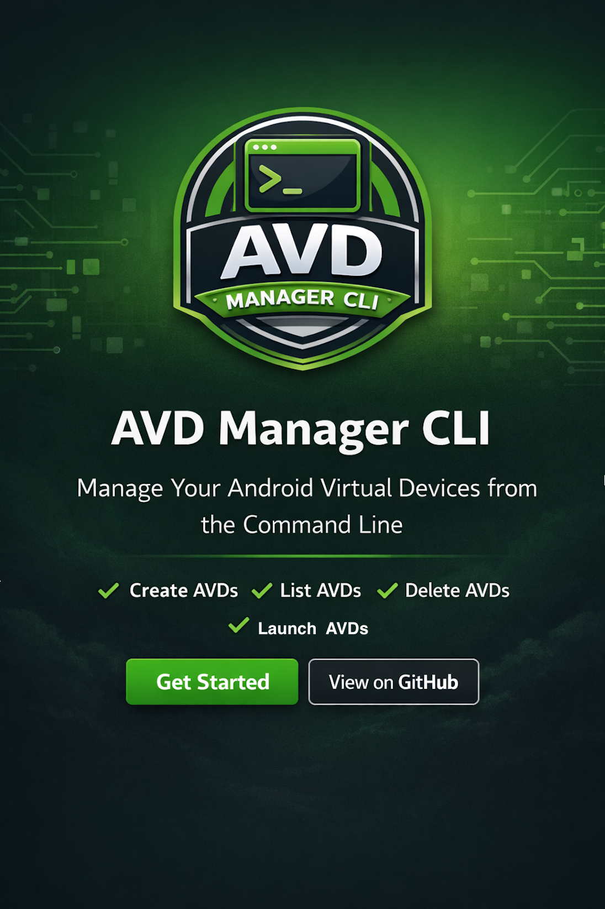

[](https://buymeacoffee.com/guimbobabag)
[](https://github.com/sponsors/Tdebo21)

# 📱 avdm - AVD Manager CLI

A lightweight DART CLI tool for managing Android Virtual Devices with ease.

## Features

- ✨ Create and manage AVDs programmatically
- 🚀 List available AVDs and their sizes
- 🔧 Launch AVDs with custom options
- 📋 Delete and clean up unused AVDs
- 🎯 Cross-platform support (macOS, Windows, Linux)

## 📦 Installation

You can install **AVD Manager CLI** using your preferred package manager, from Pub.dev, or by downloading the binary from the releases page.

```bash
# Example installation using Homebrew (macOS)
brew install avd_manager

# Get help
avdm --help
```

- **Installing from Pub.dev**

### Prerequisites

- **Dart SDK** 3.0 or higher ([Install Dart](https://dart.dev/get-dart))
- **Android SDK** with emulator tools ([Install Android Studio](https://developer.android.com/studio))
- **Java JDK** 11 or higher

### macOS

```bash
# Install from pub.dev
dart pub global activate avdm_manager

# Verify installation
avdm --version
```

### Windows

```powershell
# Using pub.dev
dart pub global activate avdm_manager

# Add Dart global bin to PATH if not already done:
# %APPDATA%\Pub\Cache\bin

# Verify installation
avdm --version
```

### Linux

```bash
# Using pub.dev
dart pub global activate avdm_manager

# Add Dart global bin to PATH (usually automatic, but verify):
# ~/.pub-cache/bin

# Verify installation
avdm --version
```

- **Installing from GitHub Releases (Binaries)**
- Users without Dart SDK can download executable from the releases page, add to PATH.

## 📚 Commands Overview

See the sidebar for detailed command documentation.

- **[list](commands/list.md)** – Show available AVDs
- **[create](commands/create.md)** – Create a new AVD
- **[launch](commands/launch.md)** – Start a virtual device
- **[delete](commands/delete.md)** – Remove an AVD

## License

MIT License - See [LICENSE](https://github.com/Tdebo21/avd_manager/blob/main/LICENSE)

## Usage

Once installed, simply run:

```bash
avdm --help
```

You’ll see a list of available commands and options.

```bash
avdm list [options]
```

## Options

- `--sort [size|name]` - Sort AVDs by size or name
- `--min-size <size>` - Only show AVDs larger than this size (e.g., 500MB, 1GB)
- `-h, --help` - Show help information

## Examples Usage

```bash
# List all AVDs
avdm list

# Sort by name
avdm list --sort name

# Filter by minimum size
avdm list --min-size 1GB

# Create a new AVD
avdm create Pixel_API_35 --device pixel --api 35

# Delete an AVD
avdm delete Pixel_API_35

# Launch a specific AVD with defaults
avdm launch TestDevice
```

## 🧩 Troubleshooting

If you encounter issues:

- Ensure Android SDK tools are installed
- Verify that avdmanager and sdkmanager are available in your PATH

## 📝 Changelog

See the full changelog in `CHANGELOG.md` for version history and updates.

## ❤️ Support & Sponsorship

If this tool saves you time or improves your workflow, consider supporting the project:

⭐ Star the repository

🐛 Submit issues

🤝 Contribute pull requests

☕ Sponsor development

Your support keeps the project growing.
[](https://buymeacoffee.com/guimbobabag)
[](https://github.com/sponsors/Tdebo21)
